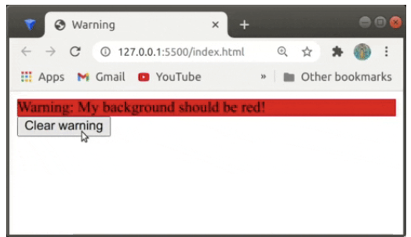

## Term 3 - Week 3 challenge.

- A simple challenge to practice JavaScript event handling.

---

# Warning

- When the user clicks the button that says "Make It Red!", the background of the div should change to red, and the text on the button should change to something else - like "Clear warning".

- When the background of the div is red, and the button has the alternate text ("Clear warning"), when the user clicks the button, the background colour should be cleared from the div, and the button text should go back to saying "Make It Red!".

--- 


--- 


--- 

## My Solution:

```jsx
let button = document.getElementById('makeItRed');
let warning = document.getElementById('warning');

let count = 0
button.addEventListener('click', function(event) {
    if (count == 0) {
        warning.style.backgroundColor="red";
        button.innerHTML = "Clear warning";
        count ++ ;
    } else {
        warning.style.backgroundColor="";
        button.innerHTML = "Make it red"
        count -- ;
    }
})
```

---

## Breakdown:

- Get the element with the id **makeItRed** and store in a variable named `button`

```jsx
let button = document.getElementById('makeItRed');
```

---

- Get the element with the id **warning** and store in a variable named "warning"

```jsx
let warning = document.getElementById('warning');
```

---

- Set a variable name `count` to 0, to count the times the button has been clicked.

```jsx
let count = 0
```

---

- Add an **event listening** on the `button` variable that listening for a click event

```jsx
button.addEventListener('click', function(event) {

}
```

---

- Inside the event listening which is listening for a click event on our `button` variable:
- Set a condition that checks if the button count is 0

```jsx

button.addEventListener('click', function(event) {
	if (count == 0) {

	}
}
```

---

- If our condition is **true** we want to change the background of our warning element to red:

```jsx
button.addEventListener('click', function(event) {
    if (count == 0) {
        warning.style.backgroundColor="red";
    }
```

---

- We also want to change the text on our button to "Clear warning":

```jsx
button.addEventListener('click', function(event) {
    if (count == 0) {
        warning.style.backgroundColor="red";
		button.innerHTML = "Clear warning";
    }
```

---

- Finally, we want to increment our `counter`by one:

```jsx
button.addEventListener('click', function(event) {
    if (count == 0) {
        warning.style.backgroundColor="red";
		button.innerHTML = "Clear warning";
		count ++ ;
    }
```

---

- Next, we need to set our `else` statement for one our `if` statement is **false**.
- Here, we want to set the background color back to its original state with an empty string:

```jsx
else {
        warning.style.backgroundColor="";
    }
```

---

- Then we want to change the text of our button back to its original state with the text "Make it red"

---

```jsx
else {
        warning.style.backgroundColor="";
        button.innerHTML = "Make it red"
    }
```

---

- Finally, we want to decrement our `count` by 1:

```jsx
else {
        warning.style.backgroundColor="";
        button.innerHTML = "Make it red";
		count -- ;
    }
```